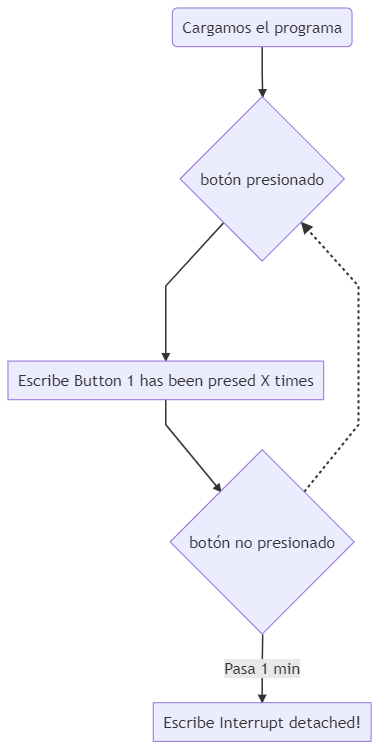
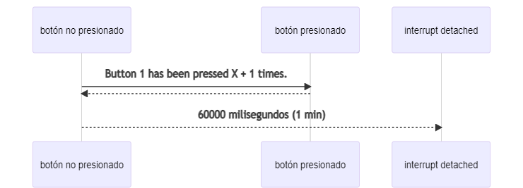

# Práctica 2.1 INTERRUPCIONES por GPIO
###### Andrea Muñiz
<p></p>

## Programa + explicación

> Estructura Button

Creamos una estructura formada por tres variables.
- __PIN__: numero del pin de la placa en el que está conectado el botón.
- __numberKeyPresses__: cantidad de veces que se presiona el botón.
- __pressed__: boleano que indica si el botón está presionado o no.

```
struct Button {
    const uint8_t PIN;
    uint32_t numberKeyPresses;
    bool pressed;
};
```

> Creamos una variable de tipo Button

```
Button button1 = {18, 0, false};
```

> Función IRAM_ATTR isr()

Esta función incrementa el numero de veces que el botón es pulsado y pone el boleano a true ya que el botón en este instante está siendo pulsado.

```
void IRAM_ATTR isr() {
    button1.numberKeyPresses += 1;
    button1.pressend = true;
}
```

> Función setup()

En esta función configuramos el pin de la placa ESP32 al que está conectado el botón e inicializamos su analisis con la función __attachInterrupt()__.

```
void setup() {
    Serial.begin(115200);
    pinMode(button1.PIN, INPUT_PULLUP);
    attachInterrupt(button1.PIN, isr, FALLING);
}
```

> Función bucle

Creamos un bucle en el que si el botón está siendo pulsado, informamos al usuario escribiendo por el monitor serie: "Button 1 has been pressed %u times/n", siendo %u el número de veces que el botón ha sudo pulsado, y a continuación volvemos a poner el boleano en false ya que el botón deja de estar pulsado.<p></p>
Finalmente si el tiempo de monitorización es superior a un minuto, interrumpimos el monitoreo.

```
void loop() {
    if (button1.pressed) {
        Serial.printf("Button 1 has been pressed %u times\n", button1.numberKeyPresses);
        button1.pressed = false;
    }
    static uint32_t lastMillis = 0;
    if (millis() - lastMillis > 60000){
        lastMillis = millis();
        detachInterrupt(button1.PIN);
        Serial.println("Interrupt Detached!");
    }
}
```

***

## Diagrama de flujo

> Código para la realización del diagrama de flujo (mediante Mermaid).

```
graph TD;
    A(Cargamos el programa) --> B{botón presionado};
    B ---> C[Escribe Button 1 has been presed X times];
    C --> D{botón no presionado};
    D -.-> B;
    D --> |Pasa 1 min| E[Escribe Interrupt detached!];
```



***

## Diagrama de secuencia

> Código para la realización del diagrama de secuencia (mediante Mermaid).

```
sequenceDiagram
    participant botón no presionado
    participant botón presionado
    participant interrupt detached

	botón no presionado ->> botón presionado: Button 1 has been pressed X + 1 times.
    botón presionado -->> botón no presionado: 
    botón no presionado -->> interrupt detached : 60000 milisegundos (1 min)
```



***

## Salidas de la impresión serie

- Presionamos el botón por primera vez:

```
Button 1 has been pressed 1 times
```

- Volvemos apresionar el botón varias veces:

```
Button 1 has been pressed 2 times
Button 1 has been pressed 3 times
Button 1 has been pressed 4 times
Button 1 has been pressed 5 times
```

- Pasados los 60000 ms (1 min) se produce la interrupción

```
Interrupt Detached!
```