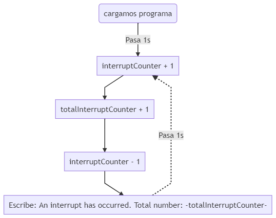
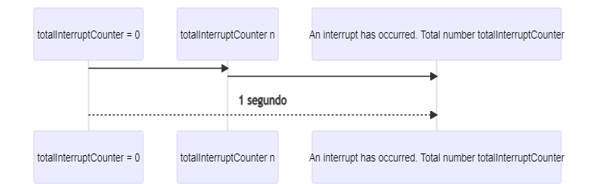

# Práctica 2 INTERRUPCIONES por TIMER
###### Andrea Muñiz
<p></p>

## Programa + explicación

> Declaramos las cabeceras a utilizar

```
#include <Arduino.h>
```

> Definimos las variables que utilizaremos

```
volatile int interruptCounter;
int totalInterruptCounter;

hw_timer_t * timer = NULL;
portMUX_TYPE timerMux = portMUX_INITIALIZER_UNLOCKED;
```

- __interruptCounter__: nos servirá como contador volatil.
- __totalInterruptCounter__: es un contador de las veces que se han producido interrupciones.
- __timer__: variable temporizador.

> Función IRAM_ATTR onTimer()

Esta función lo que hará será incrementar la variable __interruptCounter__ en 1 cada vez que se produzca una nueva interrupción.

```
void IRAM_ATTR onTimer() {
    portENTER_CRITICAL_ISR(&timerMux);
    interruptCounter++;
    portEXIT_CRITICAL_ISR(&timerMux);
}
```

> Función setup()

```
void setup() {

    Serial.begin(115200);

    timer = timerBegin(0, 80, true);
    timerAttachInterrupt(timer, &onTimer, true);
    timerAlarmWrite(timer, 1000000, true);
    timerAlarmEnable(timer);
}
```

> Función bucle 

En esta función creamos un bucle en el que si el contador de interrupciones __interruptCounter__ es mayor que 0, se analiza dicha variable y se le resta 1 como muestra de que se ha reconocido la existencia de la interrupción y pasará a ser trabajada. <p></p>
A continuación se aumenta el numero de interrupciones total, __totalInterruptCounter__, y se escribe por el monitor serie "An interrupt has ocurred. Total number: " Para hacer saber al usuario que se ha recibido una nueva interrupción y cuántas interrupciones han ocurrido ya.

```
void loop() {
    if (interruptCounter > 0) {

        portENTER_CRITICAL(&timerMux);
        interruptCounter--;
        portEXIT_CRITICAL(&timerMux);

        totalInterruptCounter++;

        Serial.print("An interrupt has occurred. Total number: ");
        Serial.println(totalInterruptCounter);
    }
}
```

***

## Diagrama de flujo

> Código para la realización del diagrama de flujo (mediante Mermaid).

```
graph TD
    A(cargamos programa) --> |Pasa 1s| B[interruptCounter + 1];
    B --> C[totalInterruptCounter + 1];
    C --> D[interruptCounter - 1];
    D --> E[Escribe: An interrupt has occurred. Total number: -totalInterruptCounter-];
    E -.-> |Pasa 1s|B;
```



***

## Diagrama de secuencia

> Código para la realización del diagrama de secuencia (mediante Mermaid).

```
sequenceDiagram
    participant totalInterruptCounter = 0
    participant totalInterruptCounter n
    participant An interrupt has occurred. Total number totalInterruptCounter

	totalInterruptCounter = 0 ->> totalInterruptCounter n: 
    totalInterruptCounter n ->> An interrupt has occurred. Total number totalInterruptCounter:  
    totalInterruptCounter = 0 -->> An interrupt has occurred. Total number totalInterruptCounter: 1 segundo
```



***

## Salidas de la impresión serie

- Pasa un segundo

```
An interrupt has occurred. Total number: 1
```

- Pasa más tiempo

```
An interrupt has occurred. Total number: 2
An interrupt has occurred. Total number: 3
An interrupt has occurred. Total number: 4
An interrupt has occurred. Total number: 5
```